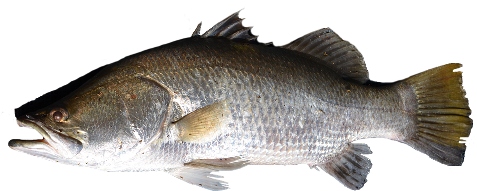

```{r setup, include=FALSE, warnings=FALSE, message=FALSE}
knitr::opts_chunk$set(echo = TRUE)
```

# Preparations

Load the necessary libraries

```{r libraries, results='markdown', eval=TRUE, message=FALSE, warning=FALSE}
library(rstanarm)   #for fitting models in STAN
library(brms)       #for fitting models in STAN
library(coda)       #for diagnostics
library(bayesplot)  #for diagnostics
library(rstan)      #for interfacing with STAN
library(emmeans)    #for marginal means etc
library(broom)      #for tidying outputs
library(DHARMa)     #for residual diagnostics
library(tidybayes)  #for more tidying outputs
library(ggeffects)  #for partial plots
library(tidyverse)  #for data wrangling etc
theme_set(theme_classic())
```

# Scenario

To investigate differential metabolic plasticity in barramundi (*Lates calcarifer*),
@Norin-2016-369 exposed juvenile barramundi to various environmental changes (increased temperature,
decreased salinity and increased hypoxia) as well as control conditions.
Metabolic plasticity was calculated as the percentage difference in standard metabolic rate between
the various treatment conditions and the standard metabolic rate under control conditions.
They were interested in whether there was a relationship between metabolic plasticity and typical (control) metabolism and
how the different treatment conditions impact on this relationship.

A total of 60 barramundi juveniles were subject to each of the three conditions (high temperature,
low salinity and hypoxia) in addition to control conditions.
Fish mass was also recorded as a covariate as this is known to influence metabolic parameters.

{width="310"}

Format of norin_csv data files

fishid   MASS    trial             SMR\_contr   CHANGE
-------- ------- ----------------- ------------ --------
1        35.69   LowSalinity       5.85         -31.92
2        33.84   LowSalinity       6.53         2.52
3        37.78   LowSalinity       5.66         -6.28
..       ..      ..                ..           ..
1        36.80   HighTemperature   5.85         18.32
2        34.98   HighTemperature   6.53         19.06
3        38.38   HighTemperature   5.66         19.03
..       ..      ..                ..           ..
1        45.06   Hypoxia           5.85         -18.61
2        43.51   Hypoxia           6.53         -5.37
3        45.11   Hypoxia           5.66         -13.95


---------------- ------------------------------------------------------------------------------------------------------------------------------------------------------
**fishid**       Categorical listing of the individual fish that are repeatedly sampled
**MASS**         Mass (g) of barramundi. Covariate in analysis
**trial**        Categorical listing of the trial (LowSalinity: 10ppt salinity; HighTemperature: 35 degrees; Hypoxia: 45% air-sat. oxygen.
**SMR\_contr**   Standard metabolic rate (mg/h/39.4 g of fish) under control trial conditions (35 ppt salinity, 29 degrees, normoxia)
**CHANGE**       Percentage difference in Standard metabolic rate (mg/h/39.4 g of fish) between Trial conditions and control adjusted for \'regression to the mean\'.
---------------- ------------------------------------------------------------------------------------------------------------------------------------------------------

# Read in the data

```{r readData, results='markdown', eval=TRUE}
norin <- read_csv('../data/norin.csv', trim_ws=TRUE) %>%
  janitor::clean_names() %>%
  mutate(fishid = factor(fishid),
         trial = factor(trial))
glimpse(norin)
```


# Exploratory data analysis

Model formula:
$$
y_i \sim{} \mathcal{N}(\mu_i, \sigma^2)\\
\mu_i =\boldsymbol{\beta} \bf{X_i} + \boldsymbol{\gamma} \bf{Z_i}
$$

where $\boldsymbol{\beta}$ and $\boldsymbol{\gamma}$ are vectors of the fixed and random effects parameters respectively 
and $\bf{X}$ is the  model matrix representing the overall intercept and effects of temperature and (centered) mean fish size on SDA peak.
$\bf{Z}$ represents a cell means model matrix for the random intercepts associated with individual fish.

# Fit the model

```{r fitModels, results='markdown', eval=FALSE, hidden=TRUE}

ggplot(norin, aes(y=CHANGE, x=trial)) + geom_boxplot()
ggplot(norin, aes(y=CHANGE, x=SMR_contr, shape=trial, color=trial)) +
    geom_smooth(method='lm') + geom_point()
#ggplot(norin, aes(y=CHANGE, x=MASS, shape=trial, color=trial)) +
#    geom_smooth(method='lm') + geom_point()
ggplot(norin, aes(y=CHANGE, x=as.numeric(fishid), color=trial)) +
    geom_point() + geom_line()

#ggplot(norin, aes(y=MASS, x=trial)) + geom_boxplot()
ggplot(norin, aes(y=CHANGE, x=MASS, color=trial)) + geom_point() + geom_smooth(method='lm')

norin_rstanarm = stan_glmer(CHANGE ~ (1|fishid)+trial*SMR_contr+MASS, data=norin,
                            prior_PD=TRUE, 
                         iter=5000, warmup=2000, chains=3, thin=5, refresh=0)
prior_summary(norin_rstanarm)

posterior_vs_prior(norin_rstanarm, color_by='vs', group_by=TRUE,
                   facet_args=list(scales='free_y'), pars=c('(Intercept)'))
ggpredict(norin_rstanarm, ~trial*SMR_contr) %>% plot(add.data=TRUE)

norin_rstanarm %>% get_variables()
plot(norin_rstanarm,  'mcmc_trace', regex_pars='^.Intercept|trial|SMR|MASS|[sS]igma')
plot(norin_rstanarm,  'mcmc_acf_bar', regex_pars='^.Intercept|trial|SMR|MASS|[sS]igma')
plot(norin_rstanarm,  'mcmc_rhat_hist', regex_pars='^.Intercept|trial|SMR|MASS|[sS]igma')
plot(norin_rstanarm,  'mcmc_neff_hist', regex_pars='^.Intercept|trial|SMR|MASS|[sS]igma')

#norin_rstan1 = stan_glmer(CHANGE ~ (trial|fishid)+trial*SMR_contr+MASS, data=norin,
#                          iter=5000, warmup=2000, chains=3, thin=5, refresh=0, cores=3)
norin_rstanarm1 = stan_glmer(CHANGE ~ (SMR_contr|fishid) + trial*SMR_contr+MASS, data=norin,
                             prior_PD=FALSE, 
                          iter=5000, warmup=2000, chains=3, thin=5, refresh=0, cores=3)
norin_rstanarm1 = update(norin_rstanarm1,  prior_PD=FALSE)


norin_rstanarm2 = stan_glmer(CHANGE ~ (trial*SMR_contr|fishid) + trial*SMR_contr+MASS, data=norin,
                             prior_PD=FALSE, 
                          iter=5000, warmup=2000, chains=3, thin=5, refresh=0, cores=3)

posterior_vs_prior(norin_rstanarm1, color_by='vs', group_by=TRUE,
                   facet_args=list(scales='free_y'), pars=c('(Intercept)'))

ggpredict(norin_rstanarm1, ~trial*SMR_contr) %>% plot(add.data=TRUE)

norin_rstanarm1 %>% get_variables()
plot(norin_rstanarm1,  'mcmc_trace', regex_pars='^.Intercept|trial|^SMR|MASS|[sS]igma')
plot(norin_rstanarm1,  'mcmc_acf_bar', regex_pars='^.Intercept|trial|^SMR|MASS|[sS]igma')
plot(norin_rstanarm1,  'mcmc_rhat_hist', regex_pars='^.Intercept|trial|^SMR|MASS|[sS]igma')
plot(norin_rstanarm1,  'mcmc_neff_hist', regex_pars='^.Intercept|trial|^SMR|MASS|[sS]igma')


(l.1 <- loo(norin_rstanarm))
(l.2 <- loo(norin_rstanarm1))
loo_compare(l.1,  l.2)


preds <- posterior_predict(norin_rstanarm,  nsamples=250,  summary=FALSE)
norin_resids <- createDHARMa(simulatedResponse = t(preds),
                            observedResponse = norin$CHANGE,
                            fittedPredictedResponse = apply(preds, 2, median))
plot(norin_resids)


g=ggpredict(norin_rstanarm) %>% plot
do.call('grid.arrange', g)

#ggemmeans(norin_rstan, ~trial)

summary(norin_rstanarm)
nms <- norin_rstanarm1 %>% get_variables()
wch <- grep('^.Intercept|trial|^SMR|[sS]igma', nms)
tidyMCMC(norin_rstanarm$stanfit,conf.int=TRUE, conf.method='HPDinterval',
         rhat=TRUE, ess=TRUE, pars=nms[wch], estimate.method='median')

tidyMCMC(norin_rstanarm1$stanfit,conf.int=TRUE, conf.method='HPDinterval',
         rhat=TRUE, ess=TRUE, pars=nms[wch], estimate.method='median')


norin_grid = with(norin, list(SMR_contr=seq(min(SMR_contr),max(SMR_contr), len=100)))
newdata = emmeans(norin_rstanarm, ~trial|SMR_contr, at=norin_grid) %>% as.data.frame
head(newdata)
ggplot(newdata, aes(y=emmean, x=SMR_contr, color=trial)) +
    geom_ribbon(aes(ymin=lower.HPD, ymax=upper.HPD, fill=trial), alpha=0.3,color=NA) +
    geom_line()

norin_grid = with(norin, list(SMR_contr=c(min(SMR_contr),mean(SMR_contr),max(SMR_contr))))

emmeans(norin_rstan, pairwise~trial|SMR_contr, at=norin_grid)

norin_em = emmeans(norin_rstan, pairwise~trial|SMR_contr, at=norin_grid)$contrast %>%
              gather_emmeans_draws() %>%
              mutate(Fit=.value)
norin_em
norin_em %>% group_by(contrast) %>% median_hdci(Fit)
norin_em %>% group_by(contrast, SMR_contr) %>% median_hdci(Fit)
## norin_em %>%
##     group_by(contrast) %>%
##     summarize(P=sum(Fit>0)/n())
norin_em %>%
    group_by(contrast, SMR_contr) %>%
    summarize(P=sum(Fit>0)/n())


bayes_R2(norin_rstanarm, re.form=NA) %>% median_hdi
bayes_R2(norin_rstanarm, re.form=~(1|fishid)) %>% median_hdi
#bayes_R2(norin_rstan1, re.form=~(SMR_contr|fishid)) %>% median_hdi

```


```{r fitModels.brms, results='markdown', eval=FALSE, hidden=TRUE}
norin = norin %>% mutate(fishid=factor(fishid),
                         trial=factor(trial))

ggplot(norin, aes(y=CHANGE, x=trial)) + geom_boxplot()
ggplot(norin, aes(y=CHANGE, x=SMR_contr, shape=trial, color=trial)) +
    geom_smooth(method='lm') + geom_point()
ggplot(norin, aes(y=CHANGE, x=MASS, shape=trial, color=trial)) +
    geom_smooth(method='lm') + geom_point()
ggplot(norin, aes(y=CHANGE, x=as.numeric(fishid), color=trial)) +
    geom_point() + geom_line()

ggplot(norin, aes(y=MASS, x=trial)) + geom_boxplot()
ggplot(norin, aes(y=CHANGE, x=MASS, color=trial)) + geom_point() + geom_smooth(method='lm')


norin_form <- bf(CHANGE ~ (1|fishid)+trial*SMR_contr+MASS, family=gaussian)

norin_brms = brm(norin_form, data=norin,
                 iter=5000, warmup=2000, chains=3, thin=5, refresh=0)

norin_brms %>% get_variables()

mcmc_plot(norin_brms,  type='trace',
          regex_pars='^b.*|sigma|^sd')

mcmc_plot(norin_brms,  type='trace',
          regex_pars='^b.Intercept|trial|SMR|MASS|[sS]igma|^sd')
mcmc_plot(norin_brms,  type='acf_bar',
          regex_pars='^b.Intercept|trial|SMR|MASS|[sS]igma|^sd')
mcmc_plot(norin_brms,  type='rhat_hist',
          regex_pars='^b.Intercept|trial|SMR|MASS|[sS]igma|^sd')
mcmc_plot(norin_brms,  type='neff_hist',
          regex_pars='^b.Intercept|trial|SMR|MASS|[sS]igma|^sd')

preds <- posterior_predict(norin_brms,  nsamples=250,  summary=FALSE)
norin_resids <- createDHARMa(simulatedResponse = t(preds),
                            observedResponse = norin$CHANGE,
                            fittedPredictedResponse = apply(preds, 2, median),
                            integerResponse =FALSE)
plot(norin_resids)
#norin_rstan1 = stan_glmer(CHANGE ~ (trial|fishid)+trial*SMR_contr+MASS, data=norin,
#                          iter=5000, warmup=2000, chains=3, thin=5, refresh=0, cores=3)
norin_form <- bf(CHANGE ~ (SMR_contr|fishid) + trial*SMR_contr+MASS, family=gaussian)
norin_brms1 = brm(norin_form, data=norin,
                  iter=5000, warmup=2000, chains=3, thin=5, refresh=0, cores=3,
                  control=list(adapt_delta=0.99))

norin_brms1 %>% get_variables()

mcmc_plot(norin_brms1,  type='trace',
          regex_pars='^b.Intercept|trial|SMR|MASS|[sS]igma|^sd')

mcmc_plot(norin_brms1,  type='trace',
          regex_pars='^b.Intercept|trial|SMR|MASS|[sS]igma|^sd')
mcmc_plot(norin_brms1,  type='acf_bar',
          regex_pars='^b.Intercept|trial|SMR|MASS|[sS]igma|^sd')
mcmc_plot(norin_brms1,  type='rhat_hist',
          regex_pars='^b.Intercept|trial|SMR|MASS|[sS]igma|^sd')
mcmc_plot(norin_brms1,  type='neff_hist',
          regex_pars='^b.Intercept|trial|SMR|MASS|[sS]igma|^sd')


(l.1 <- loo(norin_brms))
(l.2 <- loo(norin_brms1))
loo_compare(l.1,  l.2)


preds <- posterior_predict(norin_brms1,  nsamples=250,  summary=FALSE)
norin_resids <- createDHARMa(simulatedResponse = t(preds),
                            observedResponse = norin$CHANGE,
                            fittedPredictedResponse = apply(preds, 2, median))
plot(norin_resids)


g=ggpredict(norin_brms1) %>% plot
library(patchwork)
g[[1]] + g[[2]] + g[[3]]

do.call('grid.arrange', g)

ggemmeans(norin_brms1, ~trial) %>% plot

tidyMCMC(norin_brms1$fit,conf.int=TRUE, conf.method='HPDinterval',
         rhat=TRUE, ess=TRUE, estimate.method='median') %>%
  slice(1:11)

nms <- norin_brms1 %>% get_variables()
wch <- grep('^b.Intercept|trial|^b.*SMR|[sS]igma|^sd', nms)
tidyMCMC(norin_brms1$fit,conf.int=TRUE, conf.method='HPDinterval',
         rhat=TRUE, ess=TRUE, pars=nms[wch], estimate.method='median')

emmeans(norin_brms1, pairwise~trial)


norin_em = emmeans(norin_brms1, pairwise~trial)$contrast %>%
              gather_emmeans_draws() %>%
              mutate(Fit=.value)

norin_em %>%
  group_by(contrast) %>%
  median_hdi()

norin_em %>%
    group_by(contrast) %>%
  summarize(P=sum(Fit>0)/n())


norin_em %>%
  group_by(contrast, SMR_contr) %>%
  summarize(P=sum(Fit>0)/n())

norin_grid = with(norin, list(SMR_contr=seq(min(SMR_contr),max(SMR_contr), len=100)))
newdata = emmeans(norin_brms1, ~SMR_contr|trial, at=norin_grid) %>% as.data.frame
head(newdata)
ggplot(newdata, aes(y=emmean, x=SMR_contr, color=trial)) +
    geom_ribbon(aes(ymin=lower.HPD, ymax=upper.HPD, fill=trial), alpha=0.3,color=NA) +
    geom_line()

norin_grid = with(norin, list(SMR_contr=c(min(SMR_contr),mean(SMR_contr),max(SMR_contr))))

emmeans(norin_brms1, pairwise~trial|SMR_contr, at=norin_grid)

norin_em = emmeans(norin_brms1, pairwise~trial|SMR_contr, at=norin_grid)$contrast %>%
                                                                       gather_emmeans_draws()
norin_em %>% head
norin_em %>%
    group_by(contrast, SMR_contr) %>%
    median_hdi()

norin_em %>%
    group_by(contrast, SMR_contr) %>%
    summarize(P=sum(.value>0)/n())

bayes_R2(norin_brms1, re.form=NA,  summary=FALSE) %>% median_hdi
bayes_R2(norin_brms1, re.form=~(1|fishid), summary=FALSE) %>% median_hdi
bayes_R2(norin_brms1, re.form=~(SMR_contr|fishid), summary=FALSE) %>% median_hdi

```


# Model validation

# Model investigation / hypothesis testing

# Predictions

# Summary figures

# References
