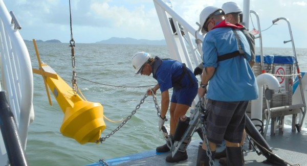

```{r setup, include=FALSE}
knitr::opts_chunk$set(echo = TRUE, warning=FALSE, message=FALSE)
```

# Preparations

Load the necessary libraries

```{r libraries, results='markdown', eval=TRUE, warning=TRUE, message=FALSE}
library(mgcv)      #for GAMs
library(gratia)    #for GAM plots
library(emmeans)   #for marginal means etc
library(broom)     #for tidy output
library(MuMIn)     #for model selection and AICc
library(lubridate) #for processing dates
library(tidyverse) #for data wrangling
library(DHARMa)    #for residuals diagnostics
library(performance) #for residual disagnostics
library(see)        # to visualize residual diagnostics
library(patchwork)  #for grids of plots
theme_set(theme_classic())
```
 
# Scenario

The Australian Institute of Marine Science (AIMS) have a long-term
inshore marine water quality monitoring program in which water samples
are collected and analysed from sites (reef_alias) across the GBR numerous times 
per year.  The focus of this program is to report long-term condition and change
in water quality parameters.

Although we do have latitude and longitudes, the nature of the spatial design
predominantly reflects a series of transects that start near the mouth of a
major river and extend northwards, yet mainly within the open coastal zone.  As
a result, this design is not well suited to any specific spatial analyses (since
they are mainly one dimensional).

{width="600" height="325"}

Format of aims.wq.csv data file

latitude longitude reef_alias water_samples region subregion season water_year nox
-------- --------- ---------- ------------- ------ --------- ------ --------- ---
-16.1    145.      Cape Trib… AIMS          Wet T… Barron D… Dry    2008      0.830
-16.1    145.      Cape Trib… AIMS          Wet T… Barron D… Wet    2008      0.100
-16.1    145.      Cape Trib… AIMS          Wet T… Barron D… Dry    2009      0.282
-16.1    145.      Cape Trib… AIMS          Wet T… Barron D… Wet    2009      1.27
-16.1    145.      Cape Trib… AIMS          Wet T… Barron D… Dry    2009      0.793
-16.1    145.      Cape Trib… AIMS          Wet T… Barron D… Dry    2010      0.380
\...     \...      \...       \...          \...   \...      \...   \...      \...

--------------     ---------------------------------------------------------------------
**latitude**       - Latitudinal coordinate
**longitude**      - Longitudinal coordinate
**reef_alias**     - Internal AIMS reef name
**water_samples**  - Categorical label of who collected the data
**region**         - The MMP region
**subregion**      - The MMP subregion
**season**         - A categorical listing of Wet or Dry
**water_year**      - The water year (1st Oct - 30 Sept) to which the data are attached
**date**           - The date the sample was collected
**nox**            - Nitrite + Nitrate added together
--------------     ---------------------------------------------------------------------

# Read in the data

```{r readData, results='markdown', eval=TRUE}
wq <- read_csv('../data/aims.wq.csv', trim_ws=TRUE) %>%
  janitor::clean_names() %>%
  select(latitude, longitude, reef_alias, water_samples, region, subregion, 
         season, water_year, month = mnth, date, nox = n_ox)
wq <- wq %>% 
  mutate(reef_alias = factor(reef_alias),
         region = factor(region),
         subregion = factor(subregion),
         season = factor(season))
glimpse(wq)
```


# Exploratory data analysis

```{r}
wq %>%
  ggplot(aes(x = date, y = nox, col = subregion)) +
  geom_point() +
  facet_grid(season ~ region)
wq %>%
  ggplot(aes(x = date, y = nox, col = subregion)) +
  geom_point() +
  facet_wrap( ~ reef_alias, scales = "free_y") +
  geom_hline(yintercept=0) +
  geom_smooth(col = "red") +
  scale_y_continuous(trans = scales::pseudo_log_trans())
```


Model formula:
$$
y_i \sim{} \mathcal{N}(\mu_i, \sigma^2)\\
\mu_i =\beta_0 + f(Date_i) + f(Month_i)
$$

where $\beta_0$ is the y-intercept. $f(Date)$ and $f(Month)$ indicate the additive smoothing functions of the long-term temporal trends and the annual seasonal trends respectively. 


# Data preparations
Use package lubridate to get dates into decimals as a numerical variable:
```{r}
wq <- wq %>% mutate(dt = decimal_date(date))
```

We'll start with a simple model only.

# Simple model (Green only) {.tabset .tabset-faded}
```{r}
wq1 <- wq %>% filter(reef_alias == "Green") %>%
  filter(complete.cases(nox))

wq1 %>% ggplot(aes(x = date, y = nox)) +
  geom_smooth() +
  scale_y_log10() +
  scale_x_date(expand = expansion()) +
  geom_point()
```

Maybe not so much this example, but other examples show that Gaussian may not work super well. However, we can try other distributions, such as a gamma (but replace all 0 detections with an arbitrarily small number), lognormal, or a tweedie.


```{r}
wq_gam1 <- gam(nox ~ s(dt), data = wq1, family = gaussian, method = "REML")
# pseudo log-normal
wq_gam2 <- gam(nox ~ s(dt), data = wq1, family = gaussian(link = "log"),
               method = "REML")
wq_gam3 <- gam(nox ~ s(dt), data = wq1, family = Gamma(link = "log"),
               method = "REML")
wq_gam4 <- gam(nox ~ s(dt), data = wq1, family = tw(link = "log"),
               method = "REML")
AICc(wq_gam1, wq_gam2, wq_gam3, wq_gam4) %>% arrange(AICc)
```

Gamma is best (wq_gam3), Tweedie is fairly similar, but on the basis of complexity, gamma is better.

# Model validation
```{r}
k.check(wq_gam3) # not over-constrained
appraise(wq_gam3) # looks ok overall.
concurvity(wq_gam3) # concurvity ok! Close to zero.
```

The fact that the observed vs. predicted is not so tight isn't necessarily surprising, considering we only have one predictor at present!

```{r}
simulateResiduals(wq_gam3, plot=T)
```

There's a slight worry about non-linearity in the residuals, not that the bottom line is red, but rather, that they all trend towards going upwards. Not a show stopper, but definitely would like to improve on this prior to selecting a final model.

```{r}
draw(wq_gam3, residuals = F)
```

# Exploring more models {.tabset .tabset-faded}

What if there were different temporal trends for wet vs. dry seasons? This how you would model this...

```{r}
wq_gam5 <- gam(nox ~ s(dt, by = season), data = wq1, family = Gamma(link = "log"),
               method = "REML")
simulateResiduals(wq_gam5, plot = T)
k.check(wq_gam5)
draw(wq_gam5)
```

What about monthly cycling, or annual cycling? We can look at this using a more fine distinction of month and day of the year effects, as a cyclical effect.

Need to tell it how many months the basis functions it is.
```{r}
wq_gam6 <- gam(nox ~ s(dt) +
                 s(month, bs = 'cc', k = 5, fx = FALSE), 
               knots = list(month = seq(1,12, length = 5)),
               data = wq1, family = Gamma(link = "log"),
               method = "REML")

```


# Mixed model (all reefs) {.tabset .tabset-faded}

Fit a random effects model per reef:
```{r}
wq_gam7 <- gam(nox ~ s(dt, by = region) +
                 s(month, bs = 'cc', by = region, k = 5) +
                 s(reef_alias, bs = "re"), 
               knots = list(month = seq(1,12, length = 5)),
               family = Gamma(link = "log"),
               data = wq, method = "REML")
k.check(wq_gam7)
```

Possibly more complexity in the date effect.

```{r}
wq_gam8 <- gam(nox ~ s(dt, by = region, k = 20) +
                 s(month, bs = 'cc', by = region, k = 5) +
                 s(reef_alias, bs = "re"), 
               knots = list(month = seq(1,12, length = 5)),
               family = Gamma(link = "log"),
               data = wq, method = "REML")
k.check(wq_gam8)
```


# Model investigation / hypothesis testing {.tabset .tabset-faded}
```{r}
summary(wq_gam8)
```
Everything by date is wiggly, the Burdekin and Wet Tropics are not wiggly, but the Mackay/Whitsundays are wiggly!
```{r}
draw(wq_gam8)
```


# Further analyses
```{r}
emmeans(wq_gam8, pairwise ~ dt, at = list(dt = c(2014,2016)), type = "response")
```
NOx is 2.52 times higher in 2014 vs. 2016!

```{r}
emmeans(wq_gam8, pairwise ~ dt|region, at = list(dt = c(2014,2016)), type = "response") %>% confint()
```

Burdekin: 2.29x
Mackay-Whitsunday: 2.24x
Wet Tropics: 3.13x

fx means that it does not force the model to have k=5, but just sets k to a max of 5. Defaults to fx = FALSE.

# Summary figures

```{r, eval=F}
wq.list <- with(wq, list(dt = modelr::seq_range(dt, n=100),
                        Region=levels(Region)))
newdata <- wq.gamm3c %>%
    emmeans(~dt, at=wq.list,
            type='response',
            #data=wq.gamm3c$model
            ) %>%
    as.data.frame
head(newdata)
ggplot(newdata, aes(y=response, x=date_decimal(Dt.num))) +
    geom_ribbon(aes(ymin=lower.CL, ymax=upper.CL), fill='blue', alpha=0.3) +
    geom_line() +
    scale_x_datetime('') +
    theme_bw()

## Partial residuals
wq.presid <- with(wq.gamm3c$model,
                  data.frame(Dt.num, Mnth))  %>%
    mutate(Pred = predict(wq.gamm3c, exclude='s(reef.alias)', type='link'),
           Resid = wq.gamm3c$resid,
           Partial.obs = exp(Pred + Resid))
  Resid=exp(
    as.vector(predict(wq.gamm3c,  exclude='s(reef.alias)',  type='link')) +
    wq.gamm3c$residuals
  )
)

head(wq.presid)
ggplot(newdata, aes(y=response, x=date_decimal(Dt.num))) +
  geom_ribbon(aes(ymin=lower.CL, ymax=upper.CL), fill='blue', alpha=0.3) +
  geom_line() +
  geom_point(data=wq.presid, aes(y=Partial.obs)) +
  geom_point(data=wq,  aes(y=NOx, x=date_decimal(Dt.num)),  color='red') +
  scale_x_datetime('') +
  scale_y_continuous(breaks=seq(0,10,by=2), limits=c(0,10))+
  theme_bw() 
```


# References

