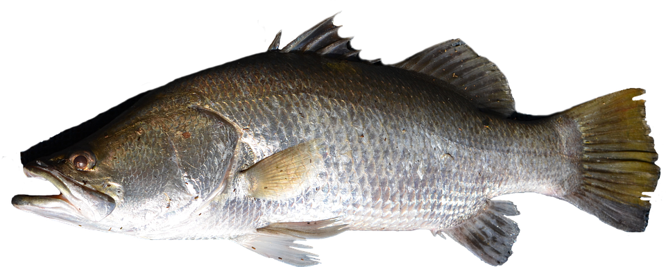

```{r setup, include=FALSE, warnings=FALSE, message=FALSE}
knitr::opts_chunk$set(echo = TRUE,  message=FALSE,  warning=FALSE)
```
  
# Preparations

Load the necessary libraries

```{r libraries, results='markdown', eval=TRUE, message=FALSE, warning=FALSE}
library(car)       #for regression diagnostics
library(broom)     #for tidy output
library(ggfortify) #for model diagnostics
library(sjPlot)    #for outputs
library(knitr)     #for kable
library(effects)   #for partial effects plots
library(ggeffects) #for partial effects plots
library(emmeans)   #for estimating marginal means
library(MASS)      #for glm.nb
library(MuMIn)     #for AICc
library(tidyverse) #for data wrangling
library(nlme)
library(lme4)
library(glmmTMB)
library(broom.mixed)
library(glmmTMB)   #for glmmTMB
library(DHARMa)   #for residuals and diagnostics
library(performance) #for diagnostic plots
library(see)         #for diagnostic plots
theme_set(theme_classic())
```

# Scenario

To investigate differential metabolic plasticity in barramundi (*Lates calcarifer*),
@Norin-2016-369 exposed juvenile barramundi to various environmental changes (increased temperature,
decreased salinity and increased hypoxia) as well as control conditions.
Metabolic plasticity was calculated as the percentage difference in standard metabolic rate between
the various treatment conditions and the standard metabolic rate under control conditions.
They were interested in whether there was a relationship between metabolic plasticity and typical (control) metabolism and
how the different treatment conditions impact on this relationship.

A total of 60 barramundi juveniles were subject to each of the three conditions (high temperature,
low salinity and hypoxia) in addition to control conditions.
Fish mass was also recorded as a covariate as this is known to influence metabolic parameters.

{width="310"}


Format of norin.csv data files

fishid   mass    trial             smr\_contr   change
-------- ------- ----------------- ------------ --------
1        35.69   LowSalinity       5.85         -31.92
2        33.84   LowSalinity       6.53         2.52
3        37.78   LowSalinity       5.66         -6.28
..       ..      ..                ..           ..
1        36.80   HighTemperature   5.85         18.32
2        34.98   HighTemperature   6.53         19.06
3        38.38   HighTemperature   5.66         19.03
..       ..      ..                ..           ..
1        45.06   Hypoxia           5.85         -18.61
2        43.51   Hypoxia           6.53         -5.37
3        45.11   Hypoxia           5.66         -13.95


---------------- ------------------------------------------------------------------------------------------------------------------------------------------------------
**fishid**       Categorical listing of the individual fish that are repeatedly sampled
**mass**         Mass (g) of barramundi. Covariate in analysis
**trial**        Categorical listing of the trial (LowSalinity: 10ppt salinity; HighTemperature: 35 degrees; Hypoxia: 45% air-sat. oxygen.
**smr\_contr**   Standard metabolic rate (mg/h/39.4 g of fish) under control trial conditions (35 ppt salinity, 29 degrees, normoxia)
**change**       Percentage difference in Standard metabolic rate (mg/h/39.4 g of fish) between Trial conditions and control adjusted for \'regression to the mean\'.
---------------- ------------------------------------------------------------------------------------------------------------------------------------------------------

# Read in the data

```{r readData, results='markdown', eval=TRUE}
norin <- read_csv('../data/norin.csv', trim_ws=TRUE) %>%
  janitor::clean_names() %>%
  mutate(fishid = factor(fishid), trial = factor(trial))
glimpse(norin)
```


# Exploratory data analysis

```{r}
norin %>%
  ggplot(aes(x = trial, y = change)) +
  geom_boxplot()
```

```{r}
norin %>% 
  ggplot(aes(x = smr_contr, y = change, shape = trial, color = trial)) +
  geom_smooth(method = "lm") +
  geom_point()

```

We can see that smr_contr + trial is similar to an ANCOVA design, as we need to see if the lines are parallel or if they are not, indicating an interaction.

```{r}
norin %>% 
  ggplot(aes(x = mass, y = change, shape = trial, color = trial)) +
  geom_smooth(method = "lm") +
  geom_point()
```

We can see that mass doesn't seem to affect change much.

We can add in mass as an offset - doesn't cost any df, but does soak up the additional variance associated. HOWEVER, it assumes the effect of mass is a 1:1 effect on response. Obviously this is not the case here.

Density is the classic example for using offset. Instead of counts, we can put it in as an offset.


Model formula:
$$
y_i \sim{} \mathcal{N}(\mu_i, \sigma^2)\\
\mu_i =\boldsymbol{\beta} \bf{X_i} + \boldsymbol{\gamma} \bf{Z_i}
$$

where $\boldsymbol{\beta}$ and $\boldsymbol{\gamma}$ are vectors of the fixed and random effects parameters respectively 
and $\bf{X}$ is the  model matrix representing the overall intercept and effects of temperature and (centered) mean fish size on SDA peak.
$\bf{Z}$ represents a cell means model matrix for the random intercepts associated with individual fish.


# Fit the model {.tabset .tabset-faded}

<div class='HIDDEN'>
For each of the following modelling alternatives, we will:

- establish whether mass is a useful covariate (based on AICc).  This step
  involves evaluating alternative fixed effects structures.  When doing so, we
  must use Maximum Likelihood (ML) rather than Residual Maximum Likelihood (REML).
- establish whether a random intercept/slope model is useful (based on AICc).
  This step involves evaluating alternative random effects structures.  When
  doing so, we should use Restricted Maximum Likelihood (REML)


## Estimate fixed effect structure with REML = F
```{r}
norin_lmm1 <- glmmTMB(change ~ trial * scale(smr_contr, scale = FALSE) +
                    offset(mass) + (1|fishid), data = norin,
                   REML = F)
better_opt <- glmmTMBControl(optimizer = "optim",
               optArgs = "Nelder-Mead")
norin_lmm2 <- glmmTMB(change ~ trial * scale(smr_contr, scale = FALSE) +
                    scale(mass, scale=F) + (1|fishid), data = norin,
                   REML = F, control = better_opt) # still has problems, even with the optimizer

norin_lmm3 <- glmmTMB(change ~ trial * scale(smr_contr, scale = FALSE) +
                  (1|fishid), data = norin,
                   REML = F)
AICc(norin_lmm1, norin_lmm2, norin_lmm3)
```

We cannot get the model with mass to converge. This may be a signal that this model is simply too complicated for the data available.

We add a third model to see what it looks like without mass included as an offset.

This third model is the best according to AICc, thus we drop mass as an important factor.


**Conclusions:**

- on the basis of AICc, the model without mass is considered the most
  parsimonious (lowest AICc)
- we will proceed with the fixed structure of model 3


## Estimate random effect structure with REML = T

```{r}
norin_lmm3 <- glmmTMB(change ~ trial * scale(smr_contr, scale = FALSE) +
                  (1|fishid), data = norin,
                   REML = T)
norin_lmm4 <- glmmTMB(change ~ trial * scale(smr_contr, scale = FALSE) +
                  (trial|fishid), data = norin,
                   REML = T)
AICc(norin_lmm3, norin_lmm4)
```
The random slope and intercept model is preferred. Thus, allowing each fish to have a different response

We could try the smr_contr as a random slope, but the problem is that each fish has the same base metabolism, so there is no variability within each fish to fit random slopes to!

```{r}
norin %>% 
  arrange(fishid) %>% select(fishid, smr_contr) %>% head(10)
```

**Conclusions:**

- unfortunately, we are unable to fit a model with random intercept/slope
- therefore we will proceed with a random intercept model


# Model validation {.tabset .tabset-faded}

```{r}
norin_lmm4 %>% simulateResiduals(plot=T)
```
Literally near perfect.

# Partial plots model {.tabset .tabset-faded}

Using sjPlot::plot_model
```{r}
norin_lmm4 %>% plot_model(type = 'eff', show.data = T) %>% plot_grid() # Misleading due to the assumption that there is no interactions
norin_lmm4 %>% plot_model(type = 'eff', terms = c("smr_contr", "trial"), 
                          show.data = T) # put both plots together

```
Using emmeans:
```{r}
norin_lmm4 %>% ggemmeans(~smr_contr|trial) %>% plot(add.data=T) # assumes no interaction
```
**Note:** that ggemmeans seems to cause errors with the x-axis coordinates of the points! This seems to be an error! Possibly doing a jitter, like in the plots with factors?


# Model investigation / hypothesis testing {.tabset .tabset-faded}
Using REML fit for interpretation.
```{r}
summary(norin_lmm4)
```

Evidence of slope x intercept correlation for high salin vs. hypoxia and high salin (-0.62) vs. low salin (r = -0.21), but not super important for model interpretation.

Very high correlations between variables indicates that bizarre stuff is happening...

```{r}
cov2cor(vcov(norin_lmm4)$cond)
```

For random effect terms:
x+(x|g) = 1+x+(1+x|g) --> Correlated random intercept and slope terms
x+(x||g) = 1+x+(1|g)+(0+x|g) --> Uncorrelated random intercept and slope terms


# Predictions / further analyses {.tabset .tabset-faded}
```{r}
summary(norin_lmm4)
tidy(norin_lmm4, conf.int=T, effect='fixed')
```
Significant slope between hypoxia and physiology, not significant between low salinity and physiology, but missing comparison of high salinity and physiology! Use emtrends to do this.

```{r}
emtrends(norin_lmm4, pairwise ~ trial, var = "smr_contr")
```
Hypoxia vs. high temp significant, everything else is not significant.

```{r}
norin_lmm4 %>% 
  emmeans(~ trial) %>% # get differences
  regrid() %>%  # does backtransform of the differences BEFORE pair-wise comparisons
  pairs() %>% # get pair-wise absolute values of differences
  confint() # get confidence interval limits for these differences
```

# Planned contrasts {.tabset .tabset-faded}
We wish to compare the pair-wise differences among these trials at specific values of physiology (smr_contr). To do so, we can create a prediction grid, then use emmeans:

```{r}
norin_grid <- with(norin, 
                   list(smr_contr = c(min(smr_contr), 
                                      mean(smr_contr),
                                      max(smr_contr))))
emmeans(norin_lmm1, pairwise ~ trial|smr_contr, at = norin_grid)
```
Shows the differences at each specific level

```{r}
r.squaredGLMM(norin_lmm4)
performance::r2_nakagawa(norin_lmm4)
```


# Summary figures {.tabset .tabset-faded}

```{r}
norin_grid <- with(norin, 
                   list(smr_contr = modelr::seq_range(smr_contr, n=100)))
newdata = emmeans(norin_lmm4, ~ smr_contr|trial, at = norin_grid) %>%
  as.data.frame() %>%
  rename(change = emmean, lwr = lower.CL, upr = upper.CL)

(g1 <- newdata %>%
  ggplot(aes(x = smr_contr, y = change)) +
  geom_ribbon(aes(ymin = lwr, ymax = upr, fill = trial), alpha = 0.3) +
  geom_line(aes(color = trial)) +
  theme(legend.position = c(0.99, 0.99),
        legend.justification = c(1,1)))
  # geom_point(data = norin, aes(col = trial)) # apparently is bad?

```
However, we can't add the plot the same way, as the model data values are standardized in a specific way according to the random effect

Thus, we have to add data a different way...
Step 1. Get predicted value for each individual via augment
Step 2. Add on the x variables lost via augment
Step 3. Add on residual value to obtain standardized values
```{r}
obs <- augment(norin_lmm4) %>% 
  bind_cols(dplyr::select(norin, smr_contr)) %>%
  mutate(partial_obs = .fitted + .resid)

g1 + 
  # geom_point(data = norin, aes(col = trial)) # looks the same, but in models where the other variables not being plotted explain a lot of the variation, will be drastically different!
  geom_point(data = obs, aes(y = partial_obs, color = trial))
```


# References
