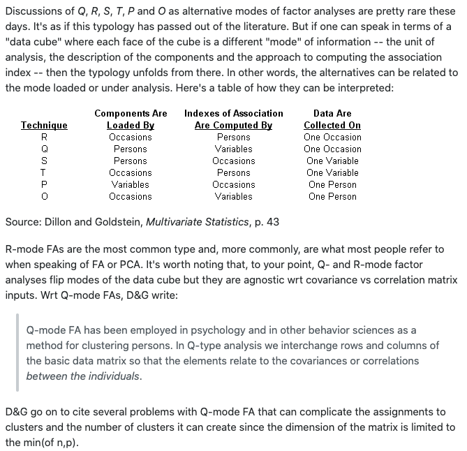

First, imagine a multivariate dataset with the rows representing the sites, columns representing different taxa/species or environmental variables.

**R-mode analyses**: examines (dis)similarity among columns
E.g.:
* PCA: Principal components analysis
* PCoA: Principal coordinate analysis
* RA: Redundancy analysis
* CA: Correspondence analysis (using chi-squared)

Uses:
We can reduce columns down to use as responses or predictors in univariate analyses

**Q-mode analyses**: examines (dis)similarity among rows
E.g.:
* MDS: multi-dimensional scaling
* NMDS: non-metric MDS
* Anything else looking at a dissimilarity matrix based on row-wise comparisons
* PERMANOVAs, ADONIS (multivariate permanova in R)

Uses:
We *cannot* reduce rows down to use as responses or predictors in univariate analyses, as we do for R-mode analyses


Note that there are multiple modes apart from these; see this response from stack overflow:


```{r}
require(tidyverse)
require(vegan)
require(ggvegan) # from github: gavinsimpson/ggvegan
require(corrplot)
require(car)
require(mvabund)
require(scales)
require(GGally)
```

```{r}
data <- read_csv("../data/data.csv", trim_ws = T) %>%
  janitor::clean_names()
glimpse(data)
enviro <- read_csv("../data/enviro.csv", trim_ws = T) %>%
  janitor::clean_names() %>% rename(pH = p_h)
glimpse(enviro)
```

# R-mode analysis

## Exploratory data analysis

Correlation plot:
```{r}
data[,-1] %>%
  cor %>%
  corrplot(type = "upper", diag = FALSE, order = "FPC")
```

We can see that some of the groups between species coming out here.

```{r}
ggpairs(data[,-1], lower = list(continuous = "smooth"),
         diag = list(continuous = "density"),
         axisLabels = "show")
```

We will transform some of these variables using a 4th root transform, as once we transform them, we don't have to worry about backtransforming anything! So the 4th root transform turns out to be a fairly good transform for community data, as it also handles zeros well.

Note: for species abundance, **it is very common to do the 4th-root transform**.
```{r}
ggpairs(data[,-1]^0.25, lower = list(continuous = "smooth"),
         diag = list(continuous = "density"),
         axisLabels = "show")
```
Looks better. Will apply this transformation!

```{r}
data_stng <- data[,-1] %>%
  mutate(across(where(is.numeric), function(x) x^0.25)) %>%
  wisconsin()
```
This performs the common Wisconsin double standardization, where species (MARGIN=2) are first standardized by maxima (max), and then sites (MARGIN=1) by site totals (tot).

## Principal component analysis:
```{r}
data_pca <- rda(data[,-1]^0.25, scale = T) # using correlation matrix
summary(data_pca, display = NULL)
```
PC1 = 44%; PC2 = 22%; PC3 = 14%; ...
Principal components 1, 2, and 3 make up 80% of the variance alone.
Another rule we can use is to take any eigenvalues > 1.

Create a biplot:
```{r}
biplot(data_pca, scaling = "species")
```
Red arrows are the component loadings - columns
Black points are the component weights - rows

Now, let's make a nice and fancy biplot:
```{r}
data_pca_scores <- data_pca %>% fortify()
g <- ggplot(data = NULL, aes(x = PC1, y = PC2)) +
  geom_hline(yintercept = 0, linetype = "dotted") +
  geom_vline(xintercept = 0, linetype = "dotted") +
  geom_text(data = filter(data_pca_scores, Score == "sites"), aes(label = Label)) +
  geom_text(data = filter(data_pca_scores, Score == "species"), 
            aes(label = Label, x = PC1*1.1, y = PC2*1.1), color = "red") +
  geom_segment(data = filter(data_pca_scores, Score == "species"),
               aes(y = 0, x = 0, yend = PC2, xend = PC1), 
               arrow = arrow(length = unit(0.3, "lines")), color = "red") +
  theme_bw()
eig <- eigenvals(data_pca)
eig_per <- eig/sum(eig)*100
g <- g + labs(x = paste0(names(eig_per[1])," (",round(eig_per[1]),"%)"), 
         y = paste0(names(eig_per[2])," (",round(eig_per[2]),"%)"))
```

For many values, we often only show the sites within some circle from 0,0:
```{r}
circle_prob <- 0.68
# r = 
r <- sqrt(qchisq(circle_prob, df = 2)) * prod(colMeans(data_pca$CA$u[,1:2]^2))^0.25
# theta
theta <- c(seq(-pi, pi, length = 50), seq(pi, -pi, length = 50))
circle <- data.frame(PC1 = r * cos(theta), PC2 = r * sin(theta))
g <- g + geom_path(data = circle, aes(y = PC2, x = PC1), color = muted("white"), size = 0.5, alpha = 0.33) +
  coord_equal()

g
```

## Principal component regression

Let's look at the correlation among our environmental predictors.

The response is irrelevant for VIF, so give arbitrary numbers here.

```{r}
vif(lm(1:nrow(enviro) ~ pH + slope + pressure + altitude + substrate,
       data = enviro))
```

VIF cutoff = 3 (~= 60% corr, while 5 ~= 80% corr)

We can get rid of pressure, as this seems entirely dependent on altitude:
```{r}
vif(lm(1:nrow(enviro) ~ pH + slope + altitude + substrate,
       data = enviro))
```

Extract axes and use environmental predictors to predict species components:
```{r}
PC1 <- data_pca_scores %>% 
  filter(Score == 'sites') %>%
  pull(PC1)
PC2 <- data_pca_scores %>% 
  filter(Score == 'sites') %>%
  pull(PC2)
lm(PC1 ~ pH + slope + altitude + substrate,
   data = enviro) %>%
  summary()
lm(PC2 ~ pH + slope + altitude + substrate,
   data = enviro) %>%
  summary()
```

Communities are related to altitude and substrate type. 

However, we can also do a multivariate method to examine the effect of environmental predictors on multiple species:

## Redundancy analysis

Get model coefficient matrix for environment effects, use with PCA model to get an environmental fit onto the model:

```{r}
Xmat <- model.matrix(~-1 + pH + slope + altitude + substrate,
                     data = enviro)
data_env <- envfit(data_pca, env = Xmat) 
```

`envfit()` takes our multivariate analysis and correlates it to environmental data.

However, it does not deal with categorical variables very well. To ensure that it works with categoricals, you can turn it into model.matrix and add -1 (it doesn't include the intercept). 

Instead of doing the difference, it analyzes them separately.

```{r}
data_env_scores <- data_env %>% fortify()
g <- g +
  geom_segment(data = data_env_scores,
               aes(y = 0, x = 0, yend = PC2, xend = PC1),
               arrow = arrow(length = unit(0.3, 'lines')),
               color = 'blue') + 
  geom_text(data = data_env_scores, aes(y = PC2*1.1,
                                              x = PC1*1.1,
                                              label = Label), 
            color = 'blue')
g
```

Note that PCA is an unconstrained PCA.
RDA is a type of constrained (using the environmental variables) PCA.

```{r}
data_stng <- wisconsin(data[, -1]^0.25)
data_pca <- rda(data_stng ~ scale(pH) + scale(slope) + scale(altitude) +
                  substrate, data = enviro, scale = FALSE)
summary(data_pca, display = NULL)

anova(data_pca, by = 'axis')
anova(data_pca, by = 'margin')
```

Axis significance interpretation: Tells us which are significant
Margin tells us the significant environmental variables.

Get the R^2:
```{r}
RsquareAdj(data_pca)
```

Note any presence of a horseshoe effect in the PCA/RDA:
Considers

## Correspondence analysis

When both sites and species covary according to some (unmeasured?) environmental gradient!

We can test to see this via iterative re-weighting to minimize $\chi^2$ residuals, then fit a linear axis across species AND site simultaneously!

Get the species proportions (divide by column totals):
```{r}
data_std <- data[,-1] %>% decostand(method = "total", MARGIN = 2)
```

Check the correspondence between species and sites:
```{r}
data_std %>% cor %>%
  corrplot(diag = F, order = "FPC")
```


### Unconstrained CA
```{r}
data_ca <- cca(data_std, scale = F)
summary(data_ca, display = NULL)
anova(data_ca)
```
We get similar stuff to the PCA with Correspondence analysis:


### Constrained CA
Similar, just set up rotation
```{r}
data_cca <- cca(data_std ~ pH + altitude + substrate + slope, data=enviro, scale = F)
summary(data_cca, display = NULL)
anova(data_cca)
```


# Principal Coordinate Analysis

Bray-Curtis similarity matrix into a PCA

capscale is for principal coordinate analysis


# Q-mode analysis

```{r}
macnally <- read.csv("../data/macnally_full.csv", strip.white = T) %>%
  janitor::clean_names()
glimpse(macnally[,1:5])

```

**Main question**
Do bird communities differ relative to plant community type?

Another way: how do birds (the objects) group and form communities based on different vegetation communities?


## Multi-dimensional scaling

Idea behind the algorithm:
Make a distance matrix of the real data.
Next, randomly scatter points representing the real data on a 2D (or higher) plane and measure the distance between them. Because they are random, they will not match at all, but we try anyways.
We use a Kruskal non-parametric/robust regression to determine if any of the distances are similar to the real-world distances.
If we have a high correlation, 0.8 is considered good. We call this stress instead, and stress = 1-correlation, so 0.2 is considered ok.

At first, we have a very high stress value. So we slightly move our random points to see if we can get a better match, and we continue to iterate repeatedly until the stress declines via a method of gradient descent. Points step based on some probability, similar to MCMC.

At some point, we need to stop, so we set a stopping rule such as:

* convergence tolerance (stress below a certain threshold)
* stress ratio (improvement in stress is so little that we don't care anymore) 
* some maximum number of iterations reached

Ideally, we would like the stress to be less than 0.2, or a correlation of about 0.8.

What about where we start? This may be important, so we run it multiple times to ensure we arrive at a consistent pattern.

How do we know which way to face all the points? Since the axes don't matter in MDS, we use Procrustes rotation to determine if the MDS ordination follows the real-world data (even in 4+D data!). We set a limit of a root mean square error (RMSE) to say that the ordination is similar enough to the real-world data.
Ideally RMSE < 0.01 and all errors < 0.005 (I think this could be incorrect...).

However, the actual algorithm already calculates Bray-Curtis by default (sqrt() then wisconsin double standardization):
```{r}
macnally_mds <- metaMDS(macnally[,-1], k = 2, plot = T)
# sqrt, wisconsin double standardization, then Bray-Curtis by default
```
Final stress = 0.143


If we had done the standardization already, e.g., 4th root transform rather than the default of square root:
```{r}
# Fourth root instead of square root:
macnally_std <- wisconsin((macnally[,-1])^0.25)
macnally_mds <- metaMDS(macnally_std, k = 2, plot = T)
```

Stress = 0.1207536

And finally, we can also do the Bray-Curtis ourselves prior to doing the MDS and it will again recognize this.

```{r}
macnally_std <- wisconsin((macnally[,-1])^0.25)
macnally_dist <- vegdist(macnally_std, "bray")
macnally_mds <- metaMDS(macnally_dist, k = 2, plot = T)
```

Stress = 0.13

If it is not fitting well (high stress), we can increase the number of dimensions:

```{r}
macnally_std <- wisconsin((macnally[,-1])^0.25)
macnally_dist <- vegdist(macnally_std, "bray")
macnally_mds_3d <- metaMDS(macnally_dist, k = 3, plot = T)
macnally_mds_3d$stress
```
Stress = 0.08 - much lower!

Ploting the MDS:
```{r}
stressplot(macnally_mds)
```

Can see that it has a better non-metric fit, rather than a linear fit.

An MDS has only a single purpose: produce an ordination plot. It does NOT go on to produce more analyses!

To make a better plot, we will have to use the original MDS, as this one returns the species when we fortify it.

Thus, we need to do the plot using the default settings.

```{r}
macnally_mds <- metaMDS(macnally[,-1], k = 2, plot = T)
macnally_mds_scores <- macnally_mds %>% fortify() %>%
  full_join(macnally %>% rownames_to_column("Label"))

g <- 
  ggplot(data = NULL, aes(x = NMDS1, y = NMDS2)) +
  geom_hline(yintercept = 0, linetype = "dotted") +
  geom_vline(xintercept = 0, linetype = "dotted") +
  geom_point(data = filter(macnally_mds_scores, Score == "sites"), 
             aes(color = habitat)) +
  geom_text(data = filter(macnally_mds_scores, Score == "sites"), 
            aes(label = Label, color = habitat), hjust = -0.05, show.legend = FALSE) +
  scale_x_continuous(limits = c(-1.25,1.25)) +
  theme_bw() +
  coord_equal()
g + ggforce::geom_mark_ellipse(
  data = filter(macnally_mds_scores, Score == "sites"),
  aes(y = NMDS2, x = NMDS1, fill = habitat), expand = 0)

# doesn't work properly:
# g + ggforce::geom_mark_hull(
#   data = filter(macnally_mds_scores, Score == "sites"),
#   aes(y = NMDS2, x = NMDS1, fill = habitat), expand = 0)
```

Add hulls instead of ellipses:
```{r}
# Calculate hull
macnally_hull <- 
  macnally_mds_scores %>%
  filter(Score == "sites") %>%
  group_by(habitat) %>% # group by what groups the hulls will be
  slice(chull(NMDS1, NMDS2)) # calculate points that make up the hull and slice them out of the data
g <- g + geom_polygon(data = macnally_hull, 
                      aes(y = NMDS2, x = NMDS1, fill = habitat), alpha = 0.2)
g
```

# PERMANOVA


